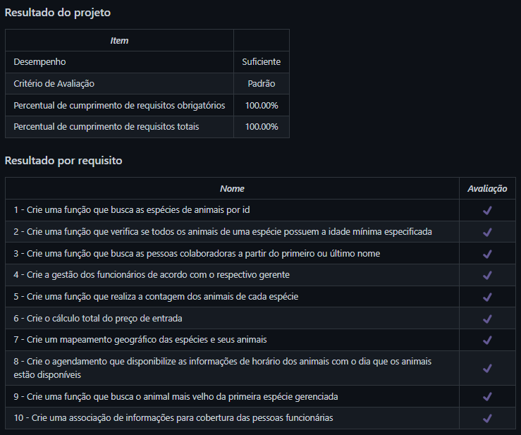

# Zoo Functions
Projeto da [Trybe](https://www.betrybe.com/) - Bloco 8 - Implementação de funções utilizando High Order Functions e outras features do Javascript ES6.

## 💻 Projeto

Implementação de funções utilizando High Order Functions e outras features do Javascript ES6 que simulam a gestão de um zoológico.

  
<strong>🏆 Meu desempenho</strong>
 

  

## 🚀 Tecnologias
> Este projeto foi desenvolvido com as seguintes tecnologias:

- JavaScript ES6

## 📌 Habilidades
> Neste projeto, desenvolvi as seguintes habilidades:

- Produzir código legível, conciso e expressivo utilizando as novas funcionalidades do ES6;
- Utilizar as Higher Order Functions para manipular e criar arrays;
- Escolher a Higher Order Function mais adequada para a obtenção de um resultado esperado;
- Aprender a usar de forma conjunta as Higher Order Functions;
- Interpretar testes unitários e produzir soluções que atendam a eles.

## 💬 Contatos

   
   
  

<!-- ## 📄 Licença

Esse projeto está sob licença. Veja o arquivo [LICENÇA](LICENSE.md) para mais detalhes.

[⬆ Voltar ao topo](#nome-do-projeto)  -->
